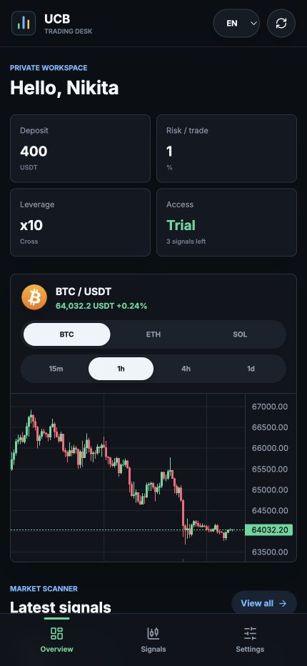
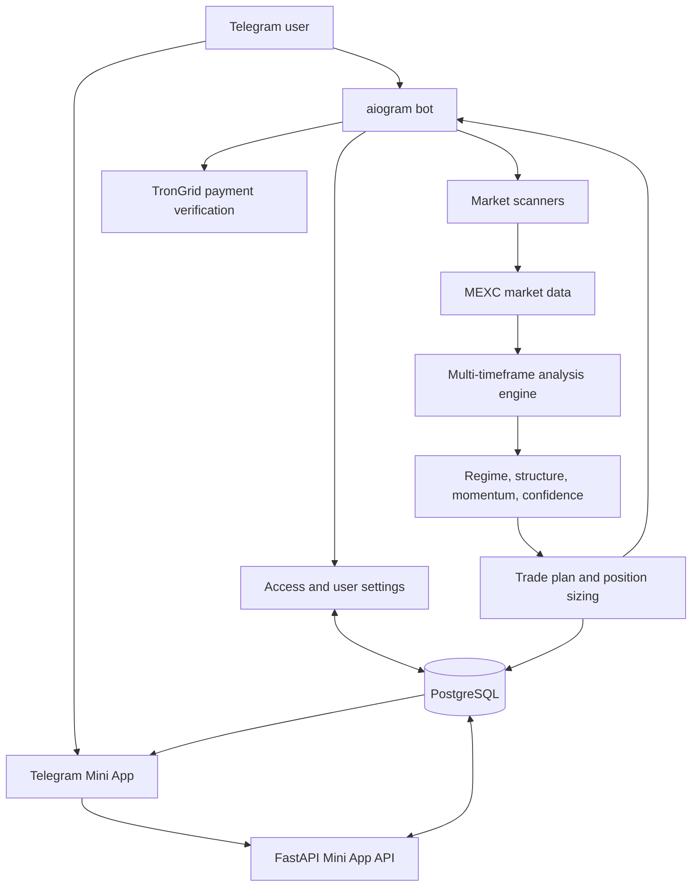

# UCB Trading

Telegram bot and Mini App for turning live MEXC Futures market data into
structured trade plans with personalized risk and position sizing.

[Launch the bot](https://t.me/ucbtrading_bot)

<p align="center">
  
</p>

<p align="center"><em>Mini App overview rendered with representative demo data.</em></p>

[Product walkthrough](docs/PRODUCT_WALKTHROUGH.md) ·
[Evaluation report](docs/EVALUATION_REPORT.md) ·
[Build timeline](docs/BUILD_TIMELINE.md) ·
[Product postmortem](docs/POSTMORTEM.md) ·
[Production smoke test](docs/PRODUCTION_SMOKE_TEST.md)

> UCB Trading is a market-analysis and decision-support product. It does not
> execute trades and does not provide financial advice.

## Product overview

UCB Trading brings market scanning, signal review, position planning, and
subscription access into one Telegram-native workflow.

A user can:

- scan liquid MEXC Futures markets for actionable setups;
- request a plan for a specific USDT pair;
- inspect live candlestick charts inside a Telegram Mini App;
- review entry, stop-loss, TP1, TP2, and confidence;
- calculate position size and required margin from a personal risk profile;
- receive deduplicated automatic alerts;
- use the interface in English, Russian, German, French, or Spanish;
- start with a limited trial and activate monthly access with USDT TRC20.

The public production entry point is
[`@ucbtrading_bot`](https://t.me/ucbtrading_bot).

## Core product flows

### Telegram bot

- `/plan BTC_USDT` creates a structured plan for one market.
- `/scan` reviews the configured market universe and ranks actionable setups.
- `/digest` returns a compact market overview.
- `/set` and `/settings` manage deposit, risk, leverage, and margin preferences.
- Automatic workers monitor priority markets, broader market conditions, and
  new MEXC listings.

### Telegram Mini App

The Mini App provides:

- an overview of the user's risk profile and access status;
- live MEXC candlestick charts across `15m`, `1h`, `4h`, and `1d`;
- recent and historical signal cards;
- detailed entry, stop, take-profit, and confidence views;
- personalized position size, margin, and stop-risk calculations;
- language, risk, leverage, and margin settings;
- trial and subscription states.

### Subscription flow

1. A user receives a limited number of trial signals.
2. The bot presents USDT TRC20 payment instructions after the trial.
3. The user submits a transaction hash.
4. The backend checks the confirmed transfer through TronGrid.
5. The bot validates token, recipient, amount, and duplicate use.
6. Successful verification activates access for the configured period.

## Architecture



The analysis path is deterministic: market data is transformed into market
context, confidence, levels, and risk calculations using explicit rules. This
makes the output inspectable and keeps the system independent of an LLM at
runtime.

## Technical highlights

- Telegram Web App `initData` validation with HMAC signature checking and
  session-age validation.
- PostgreSQL-backed profiles, subscriptions, signal history, and per-user
  signal access.
- Multi-timeframe fusion across `15m`, `1h`, `4h`, `1d`, and `1w`.
- Market-regime, price-structure, momentum, SMC, spike, flag, and false-breakout
  analysis.
- Persistent alert deduplication across deployments.
- Per-user position sizing based on deposit, risk percentage, leverage, and
  margin mode.
- Graceful Mini App demo data when no production database is configured.
- Responsive, multilingual Mini App built with browser-native JavaScript.

## Technology

- **Backend:** Python 3.9, FastAPI, aiogram, Pydantic
- **Data and analysis:** MEXC APIs, ccxt, pandas, NumPy
- **Persistence:** PostgreSQL via psycopg
- **Mini App:** HTML, CSS, JavaScript, Telegram Web App SDK
- **Charts:** TradingView Lightweight Charts
- **Payments:** USDT TRC20 verification through TronGrid

## Repository structure

```text
.
├── bot_mexc.py              # Telegram bot, commands, and background workers
├── core/
│   ├── smart_engine/        # Regime, structure, momentum, and MTF fusion
│   ├── access_manager.py    # Trial, subscription, and access state
│   ├── tron_payment.py      # Confirmed USDT TRC20 payment verification
│   └── *_scanner.py         # Market-specific scanners and policies
├── mexc/
│   └── exchange_client_mexc.py
├── miniapp/
│   ├── app.py               # FastAPI API and Telegram authentication
│   └── static/              # Mini App UI
└── trading/
    ├── analytics/           # Indicators, levels, and structure
    ├── scanner.py
    ├── trade_plan.py
    ├── state.py
    └── i18n.py
```

## Local setup

### 1. Install

```bash
git clone https://github.com/Nikiau12/traidingbot-ucb.git
cd traidingbot-ucb
python3.9 -m venv .venv
source .venv/bin/activate
pip install -r requirements.txt
pip install -r miniapp/requirements.txt
```

### 2. Configure

```bash
cp .env.example .env
```

At minimum, configure:

- `TELEGRAM_BOT_TOKEN` for the bot;
- `MINI_APP_URL` with the public HTTPS URL of the Mini App;
- `DATABASE_URL` for persistent production state.

Payment verification additionally requires a receiving wallet and should use a
TronGrid API key in production.

### 3. Run the Telegram bot

```bash
python bot_mexc.py
```

### 4. Run the Mini App API

```bash
uvicorn miniapp.app:app --reload --port 8000
```

Open `http://localhost:8000` to inspect the UI with demo data when
`TELEGRAM_BOT_TOKEN` and `DATABASE_URL` are unset.

Telegram requires a public HTTPS URL for a production Mini App. Configure that
URL through BotFather and set the same value as `MINI_APP_URL`.

## Configuration

The most important environment variables are:

| Variable | Purpose |
|---|---|
| `TELEGRAM_BOT_TOKEN` | Telegram Bot API authentication |
| `TELEGRAM_CHAT_ID` | Default notification/admin chat |
| `ADMIN_CHAT_IDS` | Comma-separated admin chat IDs |
| `MINI_APP_URL` | Public HTTPS URL of the Telegram Mini App |
| `DATABASE_URL` | PostgreSQL connection string |
| `FREE_TRIAL_SIGNALS` | Signals available before the paywall |
| `FREE_TRIAL_COOLDOWN_MINUTES` | Delay between trial signals |
| `SUBSCRIPTION_PRICE_USDT` | Subscription price |
| `SUBSCRIPTION_DAYS` | Paid-access duration |
| `USDT_PAYMENT_ADDRESS` | Receiving TRON wallet |
| `TRONGRID_API_KEY` | TronGrid API access for payment verification |
| `MEXC_API_KEY` / `MEXC_API_SECRET` | Optional authenticated MEXC access |

See [`.env.example`](.env.example) for the complete documented template.

## Tests

Install the focused development dependencies and run the suite:

```bash
pip install -r requirements-dev.txt
pytest -q
```

The suite covers deterministic analytics, Mini App API validation, Telegram
Web App signature verification, and USDT TRC20 payment verification. GitHub
Actions also compiles all Python sources and runs the tests on every push and
pull request. The current suite contains 40 passing tests, including regression
coverage that keeps Telegram commands from being swallowed by deposit
onboarding state.

## Evaluation

A reproducible evaluation was run against 20 predefined USDT perpetual pairs
using fresh live MEXC data on July 25, 2026:

| Metric | Result |
|---|---:|
| Symbols completed | 20/20 |
| Generated plans passing all invariants | 10/10 (100%) |
| Safe skips | 10 |
| Symbol-normalization cases | 65/65 (100%) |
| Risk-profile combinations | 36/36 (100%) |
| Full analysis latency | 3.18 s median / 3.30 s p90 |
| Local plan computation | 2.55 ms median |

The checks cover price ordering, target allocation, configured risk exposure,
position size, required margin, normalization, and fresh-data availability.
They measure product correctness rather than trading profitability.

Run the evaluation again with:

```bash
python evaluation/run_evaluation.py
```

See the full [evaluation report](docs/EVALUATION_REPORT.md) and
[machine-readable results](docs/evaluation-results.json).

## Reliability and security boundaries

- Secrets are loaded from environment variables and must never be committed.
- Mini App requests are authenticated with Telegram-signed initialization data.
- Payment hashes cannot be reused across accounts.
- Only confirmed transfers for the configured USDT contract, recipient, and
  minimum amount activate access.
- Signal alerts are filtered and persistently deduplicated.
- External market and payment APIs remain operational dependencies and require
  timeout/error monitoring in production.

## Current limitations

- The repository does not execute trades or connect to an exchange account for
  order placement.
- Analytical confidence is a rule-based product score, not a guarantee of
  market performance.
- Strategy performance requires separate, time-bounded backtesting and should
  not be inferred from generated signals alone.
- Production deployment, monitoring, and database provisioning are
  environment-specific.

## Portfolio context

UCB Trading is an end-to-end product case spanning product design, Telegram UX,
backend development, external API integration, data persistence, market
analysis, access control, payments, localization, deployment, and iterative
shipping.

The remaining documentation milestones are deployment and observability
documentation, deeper signal-deduplication coverage, and a product postmortem.
