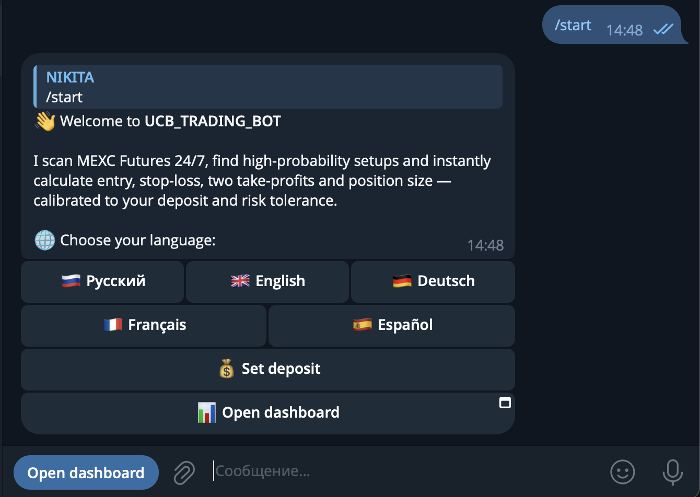
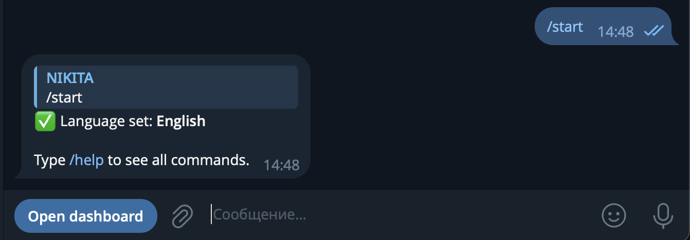
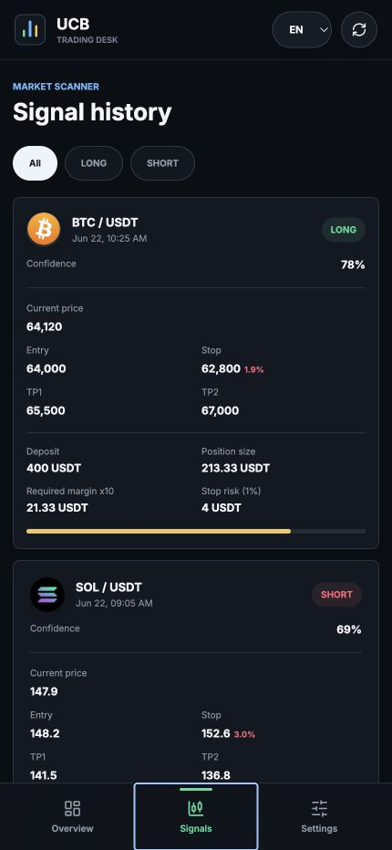
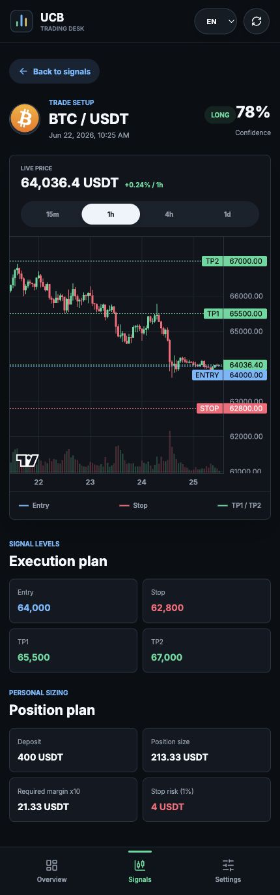
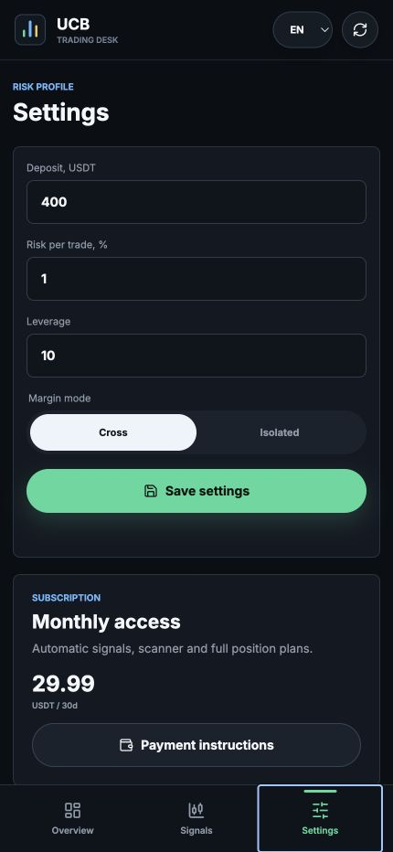
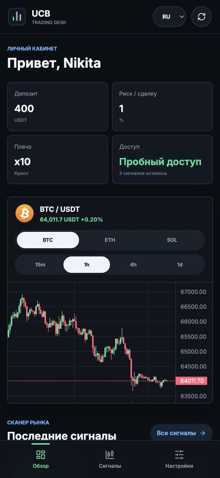
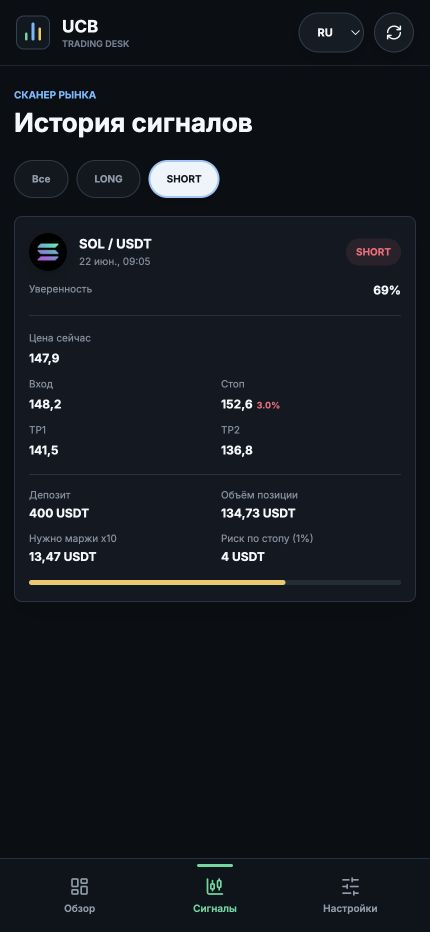

# UCB Trading — annotated product walkthrough

UCB Trading is a Telegram-native market-analysis product that connects a
conversational bot with a visual Mini App. The product turns live MEXC market
data into structured setups and adapts every position calculation to the
user's risk profile.

All screenshots below use representative demo data. They illustrate the
product and interaction model, not historical trading performance.

The Telegram captures show the live onboarding flow. The Mini App captures use
the application's built-in representative demo data.

## 1. Enter through a conversational onboarding flow



The live `/start` flow explains the value proposition, offers five languages,
asks the user to set a deposit, and provides a direct entry point into the
dashboard.



Language selection is confirmed inside the conversation, while the persistent
dashboard button remains available.

**Product decision:** use the bot for low-friction onboarding and notifications,
then move information-dense tasks into the visual Mini App.

## 2. Start the dashboard with the user's decision context


The overview puts the four inputs that change a trade plan—deposit, risk per
trade, leverage, and access state—above the market chart. A user can understand
their current context before looking at a signal.

**Product decision:** keep risk visible instead of hiding it behind a settings
screen. This makes the relationship between the user's profile and every later
position calculation explicit.

## 3. Turn scanner output into a reviewable queue



Signals are presented as comparable cards rather than unstructured Telegram
messages. Each card exposes direction, confidence, current price, entry, stop,
take-profits, and the personalized position calculation.

**Product decision:** combine market levels and personal sizing in the same
object. Users should not have to copy a signal into a separate calculator.

## 4. Make the setup inspectable



The detailed view overlays entry, stop, TP1, and TP2 on a live candlestick chart.
The same screen then explains the execution levels and position plan in exact
numbers.

**Product decision:** confidence alone is insufficient. A useful setup needs
visible invalidation, targets, and risk exposure.

## 5. Personalize risk without changing the underlying signal



Deposit, risk percentage, leverage, and margin mode belong to the user profile.
The market setup remains shared, while position size, required margin, and stop
risk are calculated per user.

**Product decision:** separate market analysis from portfolio-specific sizing.
This keeps analytical output consistent while making the result actionable for
different users.

## 6. Support multilingual use inside the product



The Mini App supports English, Russian, German, French, and Spanish. Navigation,
settings, access states, metrics, and signal labels change in the same
interface.

**Product decision:** localization is part of the product model rather than a
separate landing-page layer. The user's selected language follows them between
the Telegram bot and Mini App.

## 7. Let users narrow the signal history



The history can be filtered by direction. The filtered card preserves the full
risk and execution context rather than collapsing into a ticker-only list.

**Product decision:** filtering should reduce scanning effort without removing
the information needed to evaluate a setup.

## End-to-end product flow

```text
Telegram onboarding
        ↓
language and risk profile
        ↓
market scan or requested plan
        ↓
ranked signal with explicit levels
        ↓
live chart and personalized position sizing
        ↓
trial state or subscription access
```

## What this case demonstrates

- End-to-end product thinking across bot UX, visual UI, backend, data, and
  monetization.
- A deterministic multi-timeframe analysis system with inspectable outputs.
- Telegram Web App authentication and persistent PostgreSQL state.
- Personalization without changing the shared market-analysis layer.
- Product reliability through access controls and persistent alert
  deduplication.
- Localization across five languages.
- Iterative shipping from a command-based bot to a richer Telegram Mini App.

## Remaining production capture

The portfolio case study should eventually add one more screenshot from the
live Telegram bot:

1. a real `/plan` or `/scan` response with any sensitive user data removed.
